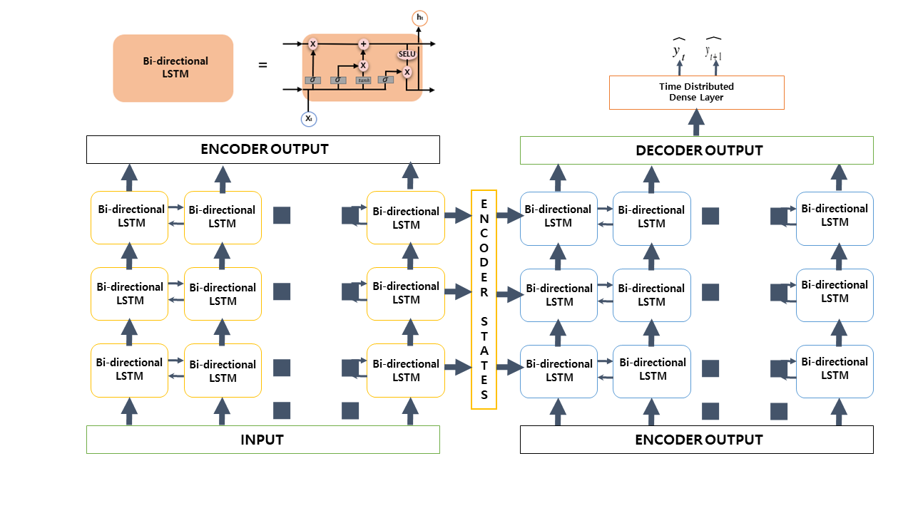

# Predicting Inflow Rate of Soyang River Dam using Deep Learning Technique



## Introduction

Soyang Dam, the largest multi-purpose dam in Korea, faces water resource management challenges due to global warming. Global warming increases the duration and frequency of days with high temperatures and extreme precipitation events. 

## Our model

We propose a Sequence-to-Sequence model based on bidirectional LSTM with SELU activation function to predict the inflow rate over the next two days. 


## Result

 


## Instructions 

**Dam_daily_data, Dam_weather_data, Dam_Warning, and Processed_data files contains data**

All executing files are numbered. Run all numbered files in order.


```python

```
